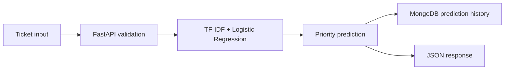

<h1 align="center">FastAPI Ticket Priority Classifier API</h1>

<p align="center">
  A small machine learning API for predicting support ticket priority from ticket text and metadata.
</p>

<p align="center">
  
  
  
  
  
  
</p>

## Overview

This project is a small ML API built with **FastAPI**. It accepts support ticket data and predicts the ticket priority.

```text
ticket data -> ML model -> FastAPI -> MongoDB history -> Docker Compose -> Cloud Run-ready setup
```

The API uses a lightweight text classification pipeline and keeps the deployment setup simple enough to run locally, in Docker, and on Cloud Run.

## Why this project

The goal is not to build a full helpdesk system. The project focuses on practical ML model serving:

- request validation with Pydantic,
- versioned `/v1` API endpoints,
- prediction history in MongoDB,
- Docker Compose setup,
- Cloud Run-ready container configuration.

## Dataset

The model is trained on the Kaggle dataset:

```text
suraj520/customer-support-ticket-dataset
```

Raw files are not committed to this repository. Locally, the dataset should be placed here:

```text
data/raw/customer_support_tickets.csv
```

To retrain the model:

```bash
python model.py --data data/raw/customer_support_tickets.csv
```

The repository contains the trained model artifact:

```text
artifacts/ticket_priority_model.joblib
```

The raw dataset is only needed when retraining the model. It is not needed to run the API.

## Model

| Element       | Value                                             |
| ------------- | ------------------------------------------------- |
| Task          | Ticket priority classification                    |
| Input         | Subject, description, ticket type, ticket channel |
| Text features | TF-IDF                                            |
| Model         | Logistic Regression                               |
| Output        | Predicted priority + confidence                   |
| Classes       | Critical, High, Low, Medium                       |
| Version       | ticket-priority-v1                                |

No strong accuracy claim is made here. The project is mainly about serving a trained model through an API with a practical deployment setup.

## API Flow



## API Endpoints

| Method | Endpoint          | Description                     |
| ------ | ----------------- | ------------------------------- |
| GET    | `/health`         | Basic health check              |
| GET    | `/info`           | Model and app metadata          |
| POST   | `/predict`        | Legacy prediction endpoint      |
| GET    | `/predictions`    | Legacy prediction history       |
| GET    | `/v1/health`      | Versioned health check          |
| GET    | `/v1/info`        | Versioned model metadata        |
| POST   | `/v1/predict`     | Recommended prediction endpoint |
| GET    | `/v1/predictions` | Versioned prediction history    |

The `/v1/*` endpoints are preferred for new usage.

## Example Prediction

PowerShell:

```powershell
Invoke-RestMethod `
  -Uri "http://localhost:8000/v1/predict" `
  -Method Post `
  -ContentType "application/json" `
  -Body '{"ticket_subject":"Login service unavailable","ticket_description":"Many users cannot log in after the latest deployment.","ticket_type":"Technical issue","ticket_channel":"Email"}'
```

Example response:

```json
{
  "predicted_priority": "High",
  "confidence": 0.4355,
  "model_version": "ticket-priority-v1",
  "api_version": "v1",
  "app_env": "development",
  "prediction_id": "..."
}
```

## MongoDB Prediction History

When `MONGODB_ENABLED=true`, the API stores prediction history in MongoDB.

| Field              | Description             |
| ------------------ | ----------------------- |
| ticket input       | Input sent to the API   |
| predicted_priority | Model prediction        |
| confidence         | Prediction probability  |
| app_env            | Current app environment |
| model_version      | Model version           |
| timestamp          | Prediction time         |

In local `uvicorn` runs, MongoDB is disabled by default. In Docker Compose, it is enabled.

## Local Setup

Windows PowerShell:

```bash
python -m venv venv
venv\Scripts\activate
pip install -r requirements.txt
uvicorn app:app --reload
```

The API runs at:

```text
http://localhost:8000
```

## Docker Compose

```bash
docker compose up -d --build
docker compose ps
```

In Compose:

- the API is available at `localhost:8000`,
- the API container listens on port `8080`,
- MongoDB is available on port `27017`,
- `MONGODB_ENABLED=true` is set for the API container.

## Tests

```bash
pytest -v
python -m compileall app.py tests
```

Current result:

```text
13 passed
```

## Project Structure

```text
.
├── app.py
├── model.py
├── requirements.txt
├── Dockerfile
├── docker-compose.yml
├── artifacts/
│   └── ticket_priority_model.joblib
├── tests/
│   ├── test_api.py
│   └── test_model.py
├── data/
│   └── raw/
└── README.md
```

`data/raw/` is local-only and is not committed.

## Environment Variables

| Variable        | Default                   | Description                           |
| --------------- | ------------------------- | ------------------------------------- |
| APP_ENV         | development               | Current app environment               |
| MONGODB_ENABLED | false                     | Enables prediction history in MongoDB |
| MONGODB_URI     | mongodb://localhost:27017 | MongoDB connection URI                |

## Model Versioning

Current model version:

```text
ticket-priority-v1
```

A new model version should be created after changing the dataset, preprocessing, features, or algorithm.

Example release tag:

```bash
git tag v1.0
git push origin v1.0
```

## Cloud Run

The Dockerfile is ready for Cloud Run because it reads the runtime port from `PORT` and falls back to `8080`:

```dockerfile
CMD ["sh", "-c", "uvicorn app:app --host 0.0.0.0 --port ${PORT:-8080}"]
```
